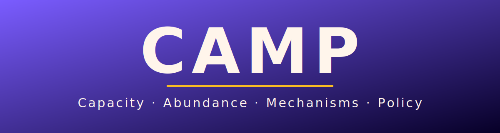

# CAMP

**Capacity, Abundance, Mechanisms, Policy.**

CAMP is an Abundance skill stack for diagnosing civic systems before action.

It helps advocates, organizers, staffers, policy researchers, and civic builders turn a public problem or policy instinct into a structured systems memo: what is broken, why it stays broken, who has power, what incentives matter, what evidence is missing, and what action is worth trying next.

The core rule is simple:

> Diagnose before advocating.

## Why CAMP Exists

Abundance politics often starts with a true instinct: build more housing, make government work, unblock infrastructure, restore state capacity, and make it easier for people to move toward opportunity.

But a good instinct is not yet a working intervention.

Public systems react. Agencies have incentives. Process has history. Veto points accumulate. Procurement rules shape what can be built. A reform that looks right on paper can mutate into delay, capture, hollow compliance, or symbolic progress.

CAMP is a workflow for slowing down just enough to understand the machinery before pushing on it.

## What It Produces

The primary artifact is an **Abundance Systems Memo**.

A memo includes:

- Problem frame
- Instinct audit
- Full-stack root cause diagnosis
- System map
- Incentive analysis
- Policy-as-organism test
- Weighted causal model
- Evidence ladder and uncertainty register
- Intervention portfolio
- Feedback and drift watchlist
- Public translation table

The memo is designed to support action, not analysis for its own sake.

## Core Workflow

CAMP is a stack of **independent, complementary skills**. If you are not sure where to start, run `camp` — it reads your situation and any existing memo, then routes you to the right skill, so you never have to memorize names. Otherwise `diagnose` is the natural front door, but any skill can be the entry point for the task you have. They share one artifact — the Abundance Systems Memo in `memos/` — so each skill reconstructs context from the memo instead of requiring a fixed order. Whichever skill you run recommends the next one based on what it found.

The intended flow:

```text
diagnose       front-door systems diagnosis -> Abundance Systems Memo
  -> foresight second-order effects, time horizons, system reaction
  -> recode    implementation mechanics: authority, procurement, staffing, ops
  -> verify    evidence: source support, confidence, overclaim risk
  -> translate internal findings -> public claims, without overclaiming
  -> test      observable feedback signals that reveal drift
  -> learn     reusable cross-domain mechanisms and cases
  -> build     circulate the memo and define the first real-world test
```

All eight worker skills plus the `camp` router are built. The follow-on skills are scaffolded with full workflows but have not yet been exercised on real policy issues — treat them as built but unproven. Routing between skills is defined in [`docs/routing-map.md`](docs/routing-map.md): each skill routes off the memo's weakest section rather than offering a flat menu. Every skill also runs through a shared guided-UI layer — a loop map, host-adaptive menus, and an agency guardrail that treats "you pick" or "just draft" as a real answer rather than asking more. See [`docs/interaction-protocol.md`](docs/interaction-protocol.md).

### `diagnose`

Turn a concrete public problem or policy idea into an Abundance Systems Memo.

### `foresight`

Stress-test second-order effects, time horizons, institutional reaction, and strategic risk.

### `recode`

Review implementation mechanics: authority, procurement, staffing, budgets, operations, legal process, IT, and feedback loops.

### `verify`

Audit evidence quality, causal weights, uncertainty, public claims, and overclaim risk.

### `translate`

Turn internal findings into public claims without laundering uncertainty into slogans.

### `test`

Define observable feedback signals that reveal drift, capture, hollow progress, or real movement.

### `learn`

Capture reusable mechanisms, cases, anti-patterns, and cross-domain lessons.

### `build`

Prepare the memo or public translation for circulation, action, follow-up, and revision.

## Installation

CAMP is currently installed by copying the skill folder into your agent's skills directory as `diagnose`.

```text
skills/diagnose -> /camp:diagnose (plugin) or diagnose (manual)
```

Codex, Claude Code, Claude Cowork, and Google Antigravity use slightly different install locations. See [`INSTALLATION.md`](INSTALLATION.md) for exact commands and a smoke test.

## Two-Pass Diagnosis

CAMP supports two levels of certainty.

**Pass one: hypothesis memo**

No live research is required. The memo is explicitly provisional. Causal weights are tentative, evidence gaps are named, and the goal is to form a useful starting model.

**Pass two: evidence-backed revision**

Live diagnostic material is gathered or ingested: agency documents, meeting minutes, statutes, budgets, procurement records, litigation, audits, local reporting, interviews, implementation data, and case studies.

When ordinary search is not enough, CAMP can generate a deep-research prompt for the user to run externally and bring back.

## Intellectual Lineage

CAMP draws from abundance and state-capacity thinking, including:

- Zack Rosen and Misha Chellam, *Modern Power* — the What/How/Why framework and grassroots power analysis that form CAMP's organizing spine
- Ezra Klein and Derek Thompson, *Abundance*
- Jennifer Pahlka, *Recoding America*
- Marc J. Dunkelman, *Why Nothing Works*
- Housing and land-use reform work
- Yoni Appelbaum, *Stuck*
- Paul Sabin, *Public Citizens*

These works provide durable lenses. They do not replace case-specific evidence.

## Repository Status

This repository is early.

What exists now:

- A `camp` router ([`skills/start`](skills/start/SKILL.md)) that triages any situation to the right skill
- Eight worker skills: `diagnose`, `foresight`, `recode`, `verify`, `translate`, `test`, `learn`, `build`
- Conditional routing between skills ([`docs/routing-map.md`](docs/routing-map.md))
- A guided-UI interaction layer across all skills ([`docs/interaction-protocol.md`](docs/interaction-protocol.md))
- The What/How/Why spine from *Modern Power* woven through the skills ([`knowledge/lenses.md`](knowledge/lenses.md))
- Memo template and diagnostic references
- Deep-research handoff prompt
- Knowledge-library structure
- GStack-to-CAMP remapping docs

What comes next:

- Test the workflow on real policy issues and harden the scaffolded follow-on skills
- Add example Abundance Systems Memos
- Build the pattern library from real cases via the `learn` skill

## Project Map

- [`INSTALLATION.md`](INSTALLATION.md): installation guide for Codex, Claude Code, Claude Cowork, Antigravity, and manual use
- [`skills/start/SKILL.md`](skills/start/SKILL.md): router — triages any situation to the right skill
- [`skills/diagnose/SKILL.md`](skills/diagnose/SKILL.md): front-door diagnosis skill
- [`skills/foresight/SKILL.md`](skills/foresight/SKILL.md): strategic foresight review
- [`skills/recode/SKILL.md`](skills/recode/SKILL.md): implementation mechanics review
- [`skills/verify/SKILL.md`](skills/verify/SKILL.md): evidence review
- [`skills/translate/SKILL.md`](skills/translate/SKILL.md): public translation review
- [`skills/test/SKILL.md`](skills/test/SKILL.md): feedback-loop check
- [`skills/learn/SKILL.md`](skills/learn/SKILL.md): pattern-library entry
- [`skills/build/SKILL.md`](skills/build/SKILL.md): circulation and first real-world test
- [`docs/routing-map.md`](docs/routing-map.md): how skills recommend each other
- [`docs/interaction-protocol.md`](docs/interaction-protocol.md): how skills present a guided UI in-chat
- [`skills/diagnose/references/memo-template.md`](skills/diagnose/references/memo-template.md): Abundance Systems Memo template
- [`skills/diagnose/references/diagnostic-lenses.md`](skills/diagnose/references/diagnostic-lenses.md): core diagnostic lenses
- [`skills/diagnose/references/deep-research-handoff.md`](skills/diagnose/references/deep-research-handoff.md): prompt pattern for external deep research
- [`docs/using-camp-with-agents.md`](docs/using-camp-with-agents.md): installation notes for Codex, Claude Code, Claude Cowork, and Antigravity
- [`docs/naming-system.md`](docs/naming-system.md): skill naming system
- [`docs/complete-remapping-matrix.md`](docs/complete-remapping-matrix.md): GStack-to-CAMP remapping
- [`knowledge/`](knowledge/): early knowledge-library structure

## Attribution

CAMP is inspired by [GStack](https://github.com/garrytan/gstack), Garry Tan's MIT-licensed agent skill workflow system.

CAMP is not official GStack and is not affiliated with or endorsed by Garry Tan or Y Combinator.

See [`NOTICE.md`](NOTICE.md) and [`LICENSE`](LICENSE).
